# SITE_MAP.md — Benny's Portfolio

> Phase 0 inventory of the single-page client-rendered app (Vite 6 + React 19 + TS,
> Tailwind v4, `motion`, `lucide-react`). Generated as the reference map for the
> SEO / performance / security optimization pass. Navigation is **not** real routing —
> it is `useState<NavigationTab>` in `src/App.tsx` synced to the URL path via
> `history.pushState` + `popstate`/`hashchange` listeners (no router, no SSR/SSG).

## 1. View / section map (Mermaid)

```mermaid
graph TD
    ROOT["index.html → #root → App.tsx"] --> HEADER["Header (sticky nav: Home/Work/Offers/Contact + theme toggle)"]
    ROOT --> MAIN["main (AnimatePresence, switches on activeTab)"]
    ROOT --> MODALS["ProjectModal · AdminPanel (overlays)"]

    MAIN --> HOME["activeTab=home  (/home)"]
    MAIN --> WORK["activeTab=work  (/work)"]
    MAIN --> OFFERS["activeTab=offers  (/offers)"]
    MAIN --> CONTACT["activeTab=contact  (/contact)"]

    HOME --> H1["#hero-region-container / #hero-section (bg video + smoke)"]
    HOME --> H2["Persona narrative (no id)"]
    HOME --> H3["Practice grid — PRACTICES[] (no id)"]
    HOME --> H4["Testimonials (component, own data)"]
    HOME --> H5["Awards placeholder (no id)"]
    HOME --> H6["Pricing placeholder (no id)"]
    HOME --> H7["#featured-article (Digi Dental case study)"]
    HOME --> H8["FAQ (component, FAQS[])"]
    HOME --> H9["#bento-footer (BottomBento)"]

    WORK --> W1["All Works list — PROJECTS[] (#project-card-*)"]
    WORK --> W2["FAQ"] --> W3["#bento-footer"]

    OFFERS --> O1["4 GlowBorderCard offer packages (hardcoded JSX, no id)"]
    OFFERS --> O2["FAQ"] --> O3["#bento-footer"]

    CONTACT --> C1["Contact info rows: location, IG, WhatsApp, mailto (no id)"]
    CONTACT --> C2["#contact-now-heading + bio (ScrollRevealParagraph + 3 collage imgs)"]
    CONTACT --> C3["YouTube link (currently youtube.com root — broken target)"]
    CONTACT --> C4["FAQ"] --> C5["#bento-footer"]

    H9 --> SOCIAL["Outbound social edges (see §3)"]
    H1 -.token.-> SUPA[("Supabase signed storage<br/>mdotuapbbscuxdnbudri.supabase.co")]
    H2 -.token.-> SUPA
    H7 -.token.-> SUPA
    C2 -.token.-> SUPA
    W1 -.token.-> SUPA
    H9 --> CF[("CloudFront mp4 (public, no token)")]
```

## 2. Views, anchors & data sources

| View (URL) | Sections (top→bottom) | Existing `id`s | Data source |
|---|---|---|---|
| `home` (`/home`) | Hero, Persona narrative, Practice grid, Testimonials, Awards (placeholder), Pricing (placeholder), Featured case study, FAQ, Footer | `hero-region-container`, `hero-section`, `featured-article`, `bento-footer` | `PRACTICES[]`, `FAQS[]`, hardcoded |
| `work` (`/work`) | All Works list, FAQ, Footer | `project-card-{proj.id}`, `bento-footer` | `PROJECTS[]` |
| `offers` (`/offers`) | 4 offer packages, FAQ, Footer | `bento-footer` | **hardcoded JSX** (not `OFFERS[]`) |
| `contact` (`/contact`) | Contact info rows, bio/quote block, YouTube link, FAQ, Footer | `contact-now-heading`, `bento-footer` | static |

**Missing `id`s** (needed for anchors / accessibility / sitemap): persona, practice grid, testimonials, awards, pricing, offers grid, work list, contact info, contact bio.

## 3. Outbound link edges (candidates for `sameAs` structured data)

| Platform | URL | Where | `rel` ok? |
|---|---|---|---|
| LinkedIn | `https://www.linkedin.com/in/ceobenny/` | data.ts proj-2, BottomBento | ✅ |
| Facebook (DigiDenty) | `https://web.facebook.com/meetdigidenty` | data.ts proj-1 (ProjectModal link) | ⚠️ via modal |
| Facebook (page) | `https://web.facebook.com/profile.php?id=61590700253409` | data.ts proj-3 | ⚠️ via modal |
| Facebook (uncrowned) | `https://web.facebook.com/bennyuncrowned` | BottomBento | ✅ |
| Instagram (entrepreneurial) | `https://www.instagram.com/ceobennyco` | App contact + BottomBento | ✅ |
| Instagram (personal) | `https://www.instagram.com/bennyuncrowned` | BottomBento | ✅ |
| YouTube | `https://www.youtube.com/@bennyunmatched` | data.ts proj-4, BottomBento | ✅ |
| YouTube (contact CTA) | `https://www.youtube.com` ← **broken/root** | App contact | ❌ fix target |
| Discord | `https://discord.gg/jm5cxrT694` | App hero + BottomBento | ✅ |
| TikTok | `https://www.tiktok.com/@ceobennyco` | BottomBento | ✅ |
| X / Twitter | `https://x.com/bennyuncrowned` | BottomBento (in `links`, not rendered as icon) | n/a |
| Pinterest | `https://pt.pinterest.com/bennyunmatched/` | BottomBento | ✅ |
| Medium | `https://medium.com/@bennyco` | BottomBento | ✅ |
| Google Maps reviews | `https://www.google.com/maps/contrib/108566019481010681421/...` | BottomBento | ✅ |
| WhatsApp | `https://wa.me/351912859130` | App contact | ✅ |
| Email | `mailto:bennysworkspace@gmail.com` | App contact + BottomBento | n/a |

## 4. External data dependencies

- **Supabase** `mdotuapbbscuxdnbudri.supabase.co` — used **only as object storage** (no `@supabase/supabase-js` installed; confirmed). All references are **signed download URLs with JWT `?token=` baked into source** (single signing key `968dec24-…`). Issued ≈ 2026-06, **expire ≈ 2027-06**, then 404. See §5.
- **CloudFront** `d8j0ntlcm91z4.cloudfront.net/...mp4` — footer video, public, no token (fine).
- **Unsplash** `images.unsplash.com/...` — testimonial avatars in `data.ts TESTIMONIALS` (array is **unused**; component uses local initials).
- **Google Fonts / Fontshare** — `@import` in `src/index.css` (Inter, JetBrains Mono, Satoshi).

## 5. Asset inventory (consumer ↔ source)

### 5a. Remote signed Supabase assets (⚠️ tokens in source — see Phase 1.1)

| # | Object | Consumer | Local equivalent? |
|---|---|---|---|
| 1 | `Images/digi_dental_linkedin_2.png` | data.ts `proj-1.image` | none exact |
| 2 | `Images/before&afterwebclienttestimonials.png` | data.ts `proj-2.image` | none exact (only separate before/after pngs) |
| 3 | `Images/FBgrowth.png` | data.ts `proj-3.image` | none exact |
| 4 | `Images/screenshot (41).jpg` | data.ts `proj-4.image` | ✅ `src/assets/images/screenshot (41).jpg` |
| 5 | `Images/skin&guthealth.png` | data.ts `proj-5.image` | none exact |
| 6 | `Videos (Under 30s)/download.mp4` | App hero bg video | none (no local video) |
| 7 | `Images/1769160829960.jpg` | App persona img | none exact |
| 8 | `Images/digi_dental_batch2_1.png` | App featured case study | none exact |
| 9 | `Images/Shoyu Ramen.jpg` | App contact collage | none |
| 10 | `Images/Japanese Dragon Stone Carving.jpg` | App contact collage | none |
| 11 | `Images/Japanese Neighborhood _.jpg` | App contact collage | none |

> Because the local `src/assets/images/` set and the remote set are **mostly different images**, remote→local swaps can only be done safely where an exact match exists (#4). The rest require Benny's Supabase access (make bucket public / move to a public marketing CDN / sign server-side).

### 5b. Local bundled assets — `src/assets/images/` (~19 MB, unoptimized)

| File | Size | Consumed by | Notes |
|---|---|---|---|
| `benny_suit.jpg` | 108 KB | App contact portrait (`new URL(...import.meta.url)`) | ✅ only local img wired in |
| `Benny Icon.png` | 540 KB | favicon (referenced as `/src/assets/images/Benny Icon.png` in index.html) | ⚠️ space in name; belongs in `/public`; oversized for a favicon |
| `benny_animemc.png` | 2.0 MB | none (orphan) | heaviest file |
| `benny_studioshot.png` | 1.5 MB | none (orphan) | |
| `Screenshot 2026-04-01 044648.png` | 1.4 MB | none (orphan) | generic name |
| `Screenshot 2026-06-14 191443.png` | 1.3 MB | none (orphan) | |
| `After client website transformation.png` | 1.1 MB | none (orphan) | |
| `Best Cliente Project.png` | 959 KB | none (orphan) | typo name |
| `Screenshot 2026-05-19 215755.png` | 898 KB | none (orphan) | |
| `screenshot (225).png` | 831 KB | none (orphan) | |
| `persona_camera_1780856917663.png` | 831 KB | none (orphan) | |
| `screenshot (124).jpg` | 749 KB | none (orphan) | |
| `Before Client Website Transformation.png` | 663 KB | none (orphan) | |
| `digi_dental_preview_1780856901934.png` | 626 KB | none (orphan) | |
| `sake_horizon_brand_1781407764714.jpg` | 611 KB | none (orphan) | |
| `1000115595.jpg` | 582 KB | none (orphan) | generic name |
| `screenshot (94).png` | 547 KB | none (orphan) | |
| `screenshot (112).png` | 483 KB | none (orphan) | |
| `screenshot (161).png` | 508 KB | none (orphan) | |
| `screenshot (222).png` | 440 KB | none (orphan) | |
| `coimbratech_afterhours.jpg` | 401 KB | none (orphan) | |
| `benny_officeyap.jpg` | 329 KB | none (orphan) | |
| `Digi Dental Banner.png` | 271 KB | none (orphan) | |
| `screenshot (104/12/25/41.jpg/41.png/43/6)` | small | none (orphan) | generic names |
| `benny_suit.jpg`,`Benny Icon.png` | — | (see above) | |

> **Only 2 of ~32 local images are actually referenced** (`benny_suit.jpg`, `Benny Icon.png`). The other ~17 MB are orphaned in the bundle directory but, since they are imported nowhere, Vite will **not** ship them to the client — they only bloat the repo. Confirm before deleting (Benny may want them for future use / they may map to the remote Supabase originals).

## 6. Component → responsibility (post-refactor)

> The original `App.tsx` monolith was decomposed during the optimization pass.
> `App.tsx` is now a layout shell; routing is real (`react-router-dom`).

| File | Role | Media |
|---|---|---|
| `src/main.tsx` | Mounts `<RouterProvider>` | — |
| `src/router.tsx` | Routes: `/` `/work` `/offers` `/contact` (+ `/home`→`/`, catch-all→`/`); lazy pages | — |
| `src/App.tsx` | Layout shell: cursor, theme toggle, header, animated `<Outlet/>`, lazy `ProjectModal`, `ProjectModalContext` provider | — |
| `src/pages/*.tsx` | `HomePage`/`WorkPage`/`OffersPage`/`ContactPage` — compose sections + `usePageMeta` | — |
| `src/sections/*.tsx` | `Hero`, `PersonaNarrative`, `PracticeGrid`, `Awards`, `Pricing`, `FeaturedCaseStudy`, `WorkList`, `OffersGrid`, `ContactDetails` | public Supabase imgs/video, local `benny_suit.jpg` |
| `src/hooks/usePageMeta.ts` | Per-route title/description/canonical/OG | — |
| `src/context/ProjectModalContext.tsx` | `useOpenProject()` for the shared modal | — |
| `src/components/CountUp.tsx`, `ScrollRevealParagraph.tsx` | Extracted shared helpers | — |
| `src/components/Header.tsx` | Sticky nav (router-driven) + theme toggle. Admin pill **removed** | — |
| `src/components/BottomBento.tsx` | Footer: social links, newsletter `<form>` (**still submits nowhere** — deferred), CloudFront video, watermark | CloudFront mp4 |
| `src/components/Testimonials.tsx` | Testimonials grid (own `SCREENSHOT_TESTIMONIALS`, not `data.ts`) | gradient initials |
| `src/components/FAQ.tsx` | FAQ accordion | uses `FAQS[]` ✅ |
| `src/components/ProjectModal.tsx` | Project detail overlay (lazy-loaded) | `project.image` (public) |
| `src/components/{SectionHeader,GlowBorderCard,MagicCursor}.tsx` | Title block / offer card / cursor | — |
| `scripts/prerender.mjs` | Post-build per-route HTML snapshots (`npm run build:prerender`) | — |
| ~~`src/components/AdminPanel.tsx`~~ | **Deleted** (was unreachable dead UI) | — |

## 7. Headline findings (status after the pass)

1. **Security (P1):** 11 Supabase signed URLs with JWTs (expire ~2027-06) → **converted to token-less `/object/public/` URLs** (Benny to flip the bucket public; rotate at leisure; history not scrubbed).
2. **Dead/misleading code (P1.3/P4):** lead-capture stack + `AdminPanel` + Header "SECURED" pill → **removed**. (Footer newsletter form still local-only — deferred.)
3. **Unused deps/data:** `@google/genai` **removed**. `express`/`dotenv` and `OFFERS[]`/`TESTIMONIALS[]` still present — deferred cleanup.
4. **SEO (P2):** `index.html` meta/OG/JSON-LD **added**; favicon **moved to `/public`** (optimized, no space); `robots.txt`/`sitemap.xml` **added**; real routing + SPA fallback + prerender **added**.
5. **Perf (P3):** lazy-loading + **code-splitting done**; image WebP/AVIF/`srcset` and video lazy-load still deferred (see CHANGELOG punch-list).
